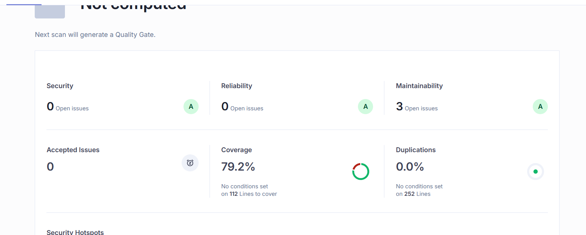

# TP 7: Implementación de Code Coverage, Análisis Estático y Testing de Integración

## Tabla de Contenidos
1. [Justificación Tecnológica](#justificación-tecnológica)
2. [Implementación de Code Coverage](#implementación-de-code-coverage)
3. [Análisis Estático con SonarCloud](#análisis-estático-con-sonarcloud)
4. [Pruebas de Integración con Cypress](#pruebas-de-integración-con-cypress)
5. [Configuración del Pipeline CI/CD](#configuración-del-pipeline-cicd)
6. [Reflexión Personal](#reflexión-personal)

---

## Justificación Tecnológica

### Stack Elegido

Para este trabajo práctico se utilizó el siguiente stack tecnológico:

#### Backend
- **Node.js 20.x**: Runtime de JavaScript del lado del servidor, versión LTS con soporte extendido
- **Express.js**: Framework web minimalista y flexible para Node.js
- **SQLite**: Base de datos relacional embebida, ideal para desarrollo y ambientes de prueba
- **Jest**: Framework de testing para JavaScript con soporte nativo de coverage

#### Frontend
- **HTML5/CSS3/JavaScript**: Stack web estándar sin frameworks adicionales

#### Testing y Calidad
- **Jest**: Testing unitario para backend y frontend
- **Cypress**: Testing end-to-end para pruebas de integración
- **SonarCloud**: Análisis estático de código y detección de code smells
- **Azure DevOps**: CI/CD pipeline con stages automatizados

### Razones de la Elección

1. **Simplicidad y Aprendizaje**: El stack elegido permite enfocarse en los conceptos de testing y CI/CD sin la complejidad adicional de frameworks modernos (React, Angular, etc.)

2. **Compatibilidad con Azure**: Node.js tiene excelente soporte en Azure App Service con deployment directo

3. **Ecosistema de Testing Maduro**: Jest y Cypress son herramientas industry-standard con documentación extensa y comunidad activa

4. **Integración Continua**: Todas las herramientas se integran nativamente con Azure DevOps Pipelines que es lo que venimos usando para el resto de nuestros TPs

---

## Implementación de Code Coverage

### 1. Configuración de Jest para Coverage

El primer paso fue configurar Jest para generar reportes de cobertura de código. Se modificó `jest.config.js` tanto para backend como frontend:

**Opciones Clave de Configuración:**

| Opción | Descripción |
|--------|-------------|
| `collectCoverageFrom` | Define qué archivos analizar (excluye tests, node_modules, etc.) |
| `coverageDirectory` | Directorio donde se guardan los reportes (`coverage/`) |
| `coverageReporters` | Formatos de salida: `text`, `html`, `lcov`, `cobertura`, `json-summary` |
| `coverageThreshold` | Umbrales mínimos: 70% para lines, statements, functions, branches |


### 2. Análisis de Cobertura Inicial vs. Final

#### Backend - Cobertura
Al ejecutar `npm test -- --coverage` por primera vez, obtuvimos:

[alt text](images/image2.png)


#### Frontend - Cobertura Inicial
El frontend mostró cobertura deficiente en funciones:
[alt text](images/image3.png)

**Problemas:**
- ❌ Functions coverage: 62.50% (5/8 funciones)
- Funciones `eliminarPalabra` y manejo de errores sin tests


#### Frontend - Cobertura Final
Se implementaron tests adicionales para `eliminarPalabra` y validaciones.

**Mejoras:**
- ✅ Functions: 62.50% → 75% (+12.5%)
- ✅ Cumple threshold de 70% en todas las métricas

[alt text](images/image4.png)

### 3. Visualización de Coverage

Los reportes HTML de Jest permiten ver línea por línea qué código está cubierto:

- **Verde**: Líneas ejecutadas por los tests
- **Rojo**: Líneas sin cobertura
- **Amarillo**: Branches parcialmente cubiertos

Se pueden abrir con: `start coverage/index.html` (Windows)

---

## Análisis Estático con SonarCloud

### 1. Configuración de SonarCloud

**Pasos realizados:**

1. **Autenticación**: Login en SonarCloud con cuenta de Azure DevOps

2. **Creación del Proyecto**:
   - Organization: `sofiaoliveto`
   - Project Key: `sofiaoliveto_TP7`
   - Project Name: `TP7`

3. **Service Connection en Azure DevOps**:
   - Crear conexión `sonar-cloud-connection`
   - Autorizar acceso entre Azure DevOps y SonarCloud

4. **Archivo de Configuración** (`sonar-project.properties`)
Se incluye informacion del proyecto, rutas del codigo fuente, exlusiones, tests y lenguajes testeables

### 2. Integración en el Pipeline

Se agregaron 3 tareas al pipeline de Azure DevOps:

**Tarea 1: Prepare Analysis Configuration** (antes del build)
```yaml
- task: SonarCloudPrepare@3
  inputs:
    SonarCloud: 'sonar-cloud-connection'
    organization: 'sofiaoliveto'
    scannerMode: 'cli'
    configMode: 'file'
    cliProjectKey: 'sofiaoliveto_TP7'
    cliProjectName: 'TP7'
    cliSources: '.'
```

**Tarea 2: Run Code Analysis** (después del build)
```yaml
- task: SonarCloudAnalyze@3
  inputs:
    jdkversion: 'JAVA_HOME_17_X64'
```

**Tarea 3: Publish Quality Gate Result** (después del anterior)
```yaml
- task: SonarCloudPublish@3
  inputs:
    pollingTimeoutSec: '300'
```

### 3. Resultados del Análisis Estático



**Acciones Tomadas:**
- Se priorizaron por impacto (no había críticos para corregir)
- Quality Gate configurado para fallar si aparecen bugs o vulnerabilities

---

## Pruebas de Integración con Cypress

### 1. Instalación y Configuración

**Instalación:**
```bash
npm install cypress --save-dev
```

**Inicialización:**
```bash
npx cypress open
```

**Configuración** (`cypress.config.js`)
Se incluyo el código de la guía

### 2. Casos de Prueba Implementados

#### **CP1: Creación Exitosa de Palabra**

**Objetivo:** Verificar el flujo completo de agregar una nueva palabra

**Spec:** `cypress/e2e/add_word.cy.js`

**Resultado:**


---

#### **CP2: Eliminación de Palabra (Confirmada)**

**Objetivo:** Validar el flujo completo de borrado cuando el usuario confirma

**Spec:** `cypress/e2e/delete.cy.js`

**Resultado:**


---

#### **CP3: Cancelación de Eliminación**

**Objetivo:** Verificar que NO se elimina si el usuario cancela la confirmación

**Spec:** `cypress/e2e/delete_cancelled.cy.js`

**Resultado:**


---

#### **CP4: Validación de Palabra Vacía**

**Objetivo:** Verificar manejo de errores al intentar agregar palabra vacía

**Spec:** `cypress/e2e/add_empty_word.cy.js`

**Resultado:**


---

### 3. Estrategia de Testing E2E

**Puntos Clave:**

1. **Aislamiento de Tests**: Cada test usa palabras únicas con timestamp para evitar colisiones
2. **Esperas Inteligentes**: Se usan `cy.wait()` y assertions para sincronización robusta
3. **Verificación Dual**: Se valida tanto en UI como en backend (via `cy.request`)
4. **Manejo de Diálogos**: Se usa `cy.stub()` para controlar `window.confirm`
5. **Retries Automáticos**: Configurados 2 reintentos en modo CI para flakiness

---

## Configuración del Pipeline CI/CD

### Arquitectura del Pipeline

El pipeline se divide en **3 stages principales**:

```
┌─────────────────────────────────────────────────────────────┐
│ STAGE 1: BuildAndTest                                      │
├─────────────────────────────────────────────────────────────┤
│ ├─ Backend Unit Tests + Coverage                           │
│ ├─ Verify Backend Coverage Threshold (70%)                 │
│ ├─ Frontend Unit Tests + Coverage                          │
│ ├─ Verify Frontend Coverage Threshold (70%)                │
│ ├─ SonarCloud Prepare → Analyze → Publish                  │
│ └─ Build & Package Artifacts                               │
└─────────────────────────────────────────────────────────────┘
                            ↓
┌─────────────────────────────────────────────────────────────┐
│ STAGE 2: Deploy_QA                                         │
├─────────────────────────────────────────────────────────────┤
│ ├─ Deploy to Azure Web App (QA)                            │
│ ├─ Health Check                                            │
│ └─ Run Cypress Integration Tests                           │
└─────────────────────────────────────────────────────────────┘
```

### Resultados del Pipeline

Los resultados se publican en la pestaña **Tests** de Azure DevOps:

**Tests Unitarios:**


**Code Coverage:**


**SonarCloud Quality Gate:**


**Tests E2E (Cypress):**


---

## Reflexión Personal

**Desafíos técnicos enfrentados:**

1. **Configurar coverage con múltiples formatos**: Jest necesita `cobertura` para Azure DevOps, pero `lcov` para SonarCloud — aprendí sobre reporters múltiples.

2. **Timing en tests de Cypress**: Al principio, los tests eran flaky porque no esperaba correctamente las cargas asíncronas — aprendí sobre `cy.wait()` estratégico.

3. **Exclusiones en SonarCloud**: Inicialmente analizaba `node_modules` y `cypress/`, generando miles de falsos positivos — aprendí la importancia de configurar bien `sonar-project.properties`.

**Lecciones técnicas:**

- **Principio de Pirámide de Tests**: Muchos tests unitarios (rápidos, baratos), algunos tests de integración, pocos E2E (lentos, caros).
- **Coverage != Calidad**: 100% coverage con tests malos es peor que 70% con tests bien diseñados.
- **Automatización temprana**: Configurar CI/CD desde el día 1 es más fácil que agregarlo a un proyecto maduro.

### Conclusión

Este trabajo práctico me demostró que **calidad no es opcional** en software profesional. Las herramientas de testing, coverage y análisis estático no son "nice to have" — son la diferencia entre:

- Código que funciona HOY vs. código que funcionará en 6 meses
- Deployar con confianza vs. deployar con miedo
- Equipo que escala vs. equipo que se ahoga en bugs

La inversión inicial en aprender Jest, Cypress, SonarCloud y configurar pipelines se paga en **tranquilidad mental** y **velocidad sostenible**.