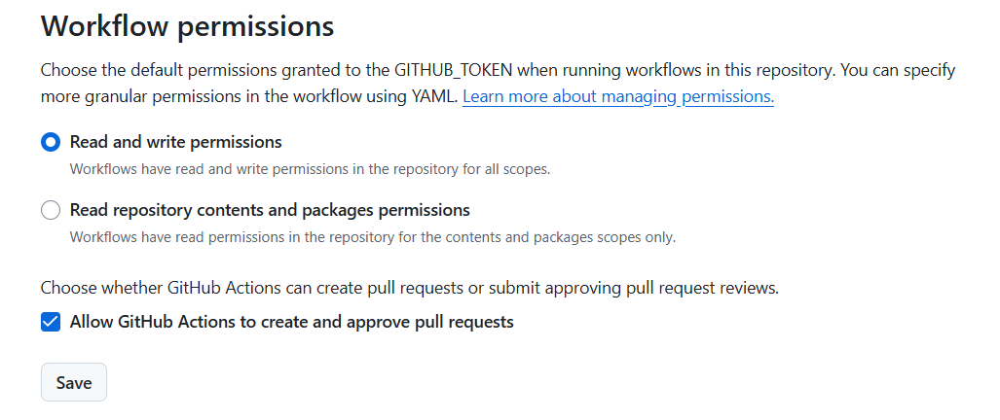
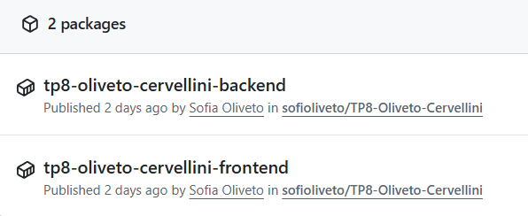
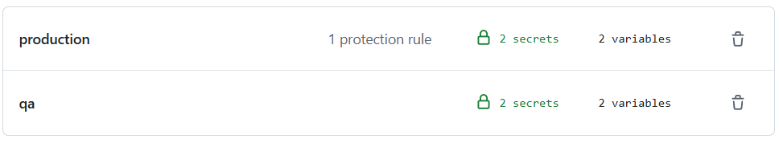
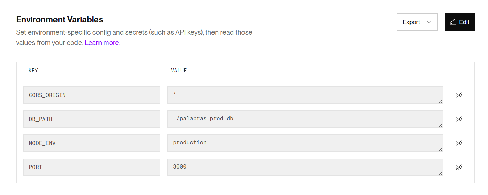
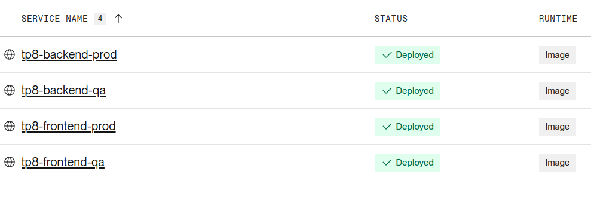
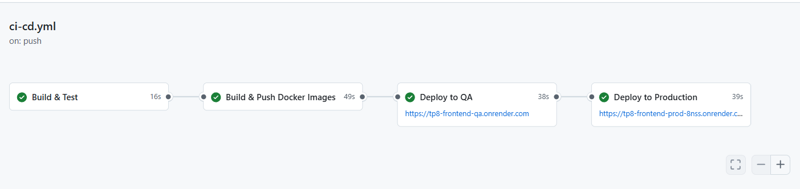
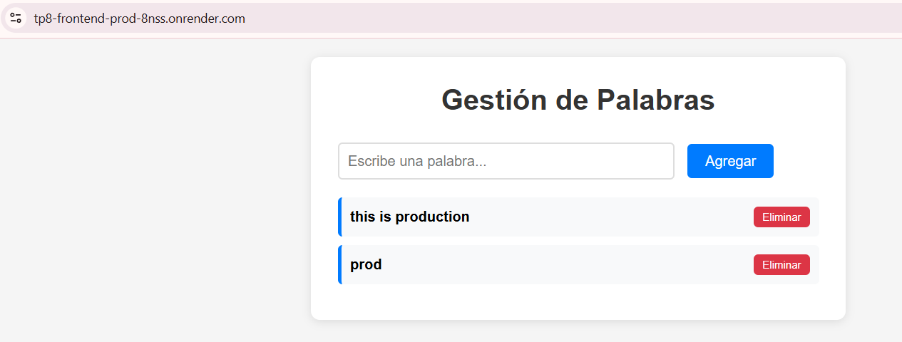
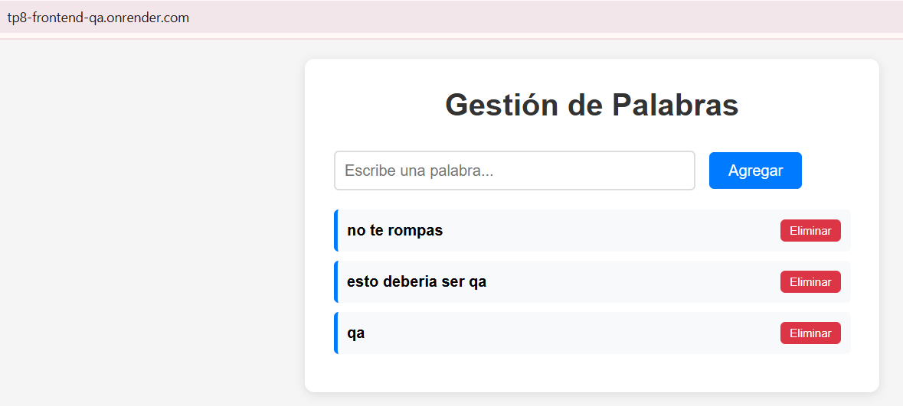

# TP8 – Contenedores en la Nube
## Decisiones Arquitectónicas y Técnicas

Este documento resume las decisiones arquitectónicas, tecnológicas e implementaciones realizadas para el TP de Contenedores en la Nube.

---

# 1. Stack Tecnológico

## Aplicación: Sistema de Gestión de Palabras

### Componentes Técnicos

**Backend:**
- **Runtime:** Node.js 18
- **Framework:** Express.js
- **Base de datos:** SQLite (embebida)
- **Testing:** Jest + Supertest

**Frontend:**
- **Stack:** HTML/CSS/JavaScript vanilla
- **Servidor:** Nginx Alpine

**Infraestructura:**
- **Container Registry:** GitHub Container Registry (GHCR)
- **CI/CD:** GitHub Actions
- **Hosting QA y PROD:** Render.com

### Justificación del Stack

#### ¿Por qué Node.js + Express?
- ✅ **Ligero y eficiente** para APIs REST
- ✅ **Amplio soporte** de librerías y herramientas
- ✅ **JavaScript full-stack** (mismo lenguaje frontend/backend)
- ✅ **Excelente para contenedores** (pequeño footprint)

#### ¿Por qué SQLite?
- ✅ **Sin servidor externo** (base de datos embebida)
- ✅ **Costo $0** adicionales
- ✅ **Suficiente para el alcance** del TP
- ⚠️ **Limitación conocida:** No apto para alta concurrencia (>100 usuarios simultáneos)

#### ¿Por qué Frontend Vanilla + Nginx?
- ✅ **Sin dependencias de build** complejos (no webpack, no babel)
- ✅ **Nginx extremadamente eficiente** para archivos estáticos
- ✅ **Imágenes Docker pequeñas** (~20MB vs >100MB con frameworks)
- ✅ **Rápido de servir** y cachear

---

# 2. Proceso Cronológico de Implementación

## 2.1. Dockerización de la Aplicación

### Backend Dockerfile

**Características implementadas:**
- **Base:** `node:18-alpine` (imagen liviana ~40MB)
- **Multi-stage build** para optimizar tamaño final
- **Usuario no-root** (`node`) para seguridad
- **Health check** en `/health`

### Frontend Dockerfile

**Características implementadas:**
- **Base:** `nginx:alpine` (~20MB)
- **Configuración nginx optimizada** para SPA
- **Gzip compression** habilitado
- **Cache headers** para assets estáticos
- **Health check** simple

**Motivo de separar Frontend y Backend:**
- ✅ **Escalado independiente:** Cada servicio puede crecer por separado
- ✅ **Deployment independiente:** Cambios en frontend no requieren rebuild del backend
- ✅ **Menor tamaño:** Cada imagen contiene solo lo necesario
- ✅ **Mejor separación de responsabilidades**

---

## 2.2. Configuración del Container Registry

### GitHub Container Registry (GHCR)

**Decisión:** Usar GHCR como registry principal

**Justificación:**
- ✅ **Gratuito ilimitado** para repositorios públicos
- ✅ **Integración nativa** con GitHub Actions
- ✅ **Autenticación automática** con `GITHUB_TOKEN`
- ✅ **Sin configuración adicional** requerida

**Imágenes publicadas:**
- `tp8-oliveto-cervellini-backend`
- `tp8-oliveto-cervellini-frontend`

---

## 2.3. Creación del Pipeline CI/CD – GitHub Actions

En el directorio `.github/workflows/` se configuró un workflow genérico que:

1. Construye backend y frontend.  
2. Genera imágenes de front y back.  
3. Publica todas las imágenes a GHCR.  
4. Despliega o deja preparado el despliegue hacia QA/PROD. (este se agregó despues de crear las web services en render)

**Motivo:** Automatizar todo el ciclo de build → empaquetado → publicación.

Previamente a la ejecución del pipeline se crearon los environments qa y production con sus respectivos secretos (RENDER_BACKEND_PROD_DEPLOY_HOOK, RENDER_FRONTEND_PROD_DEPLOY_HOOK y para qa con sus respectivos nombres) y variables (URL_BACKEND_PROD, URL_FRONTEND_PROD y para qa con sus respectivos nombres). Además en production se configuro una protection rules para que se requiera aprobacion de un usuario.

---

## 2.4. Deploy del ambiente QA en Render

Con las imágenes publicadas (`tp8-oliveto-cervellini-backend` y `tp8-oliveto-cervellini-frontend`), se crearon dos web services tp8-backend-qa y tp8-frontend-qa 

- Servicio creado desde imagen Docker.  
- Variables de entorno específicas para QA.  
- Plan free tier.  

**Motivo para usar Render QA:**  
Gratis, simple y permite testear el comportamiento del contenedor en la nube.

---

## 2.5. Deploy del ambiente PROD en Render

Se configuraron dos web services en Render tp8-backend-prod y tp8-frontend-prod , con las mismas imágenes.

Diferencias principales respecto a QA:

- Variables de entorno específicas para QA. 
- Diferente base de datos.
- Configuración distinta dentro del free tier.  

**Motivo:**  
Render facilita mantener QA y PROD como dos servicios independientes, cumpliendo con la consigna del TP.

---

## 2.6. Quality Gates y aprobaciones manuales

A nivel pipeline, se contempla:

- Test aprobados.
- Validación del build.  
- Validación de la creación de imágenes.  
- QA como primer paso de despliegue.  
- Aprobación manual previa a PROD.  

---

# 3. Justificación Final de las Decisiones y resultados

### Web services de front funcionando conectadas al web services del back

### 3.1. Por qué Docker  
Permite empaquetar y ejecutar la aplicación sin dependencias externas.

### 3.2. Por qué GHCR  
Integración directa con GitHub y publicación automática de imágenes sin credenciales adicionales.

### 3.3. Por qué Render para QA y PROD  
- Simplicidad  
- Plan gratuito  
- Deploy directo desde imágenes Docker

### 3.4. Por qué GitHub Actions  
Automatización completa dentro del mismo repositorio.

---

# 4. Reflexión y Aprendizajes

- Aprendimos a contenerizar backend y frontend.  
- Publicamos imágenes reales en GHCR.  
- Armamos un pipeline CI/CD con GitHub Actions.  
- Desplegamos QA y PROD en Render.  
- Entendimos cómo separar ambientes de forma profesional.

